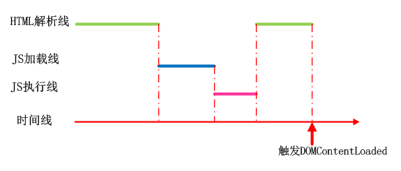
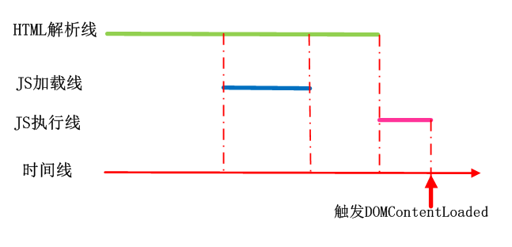
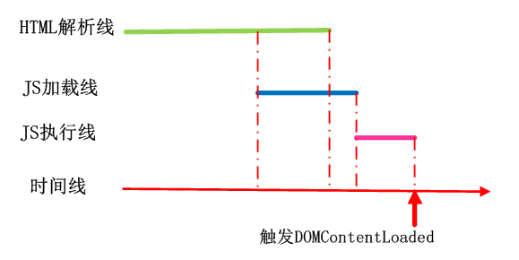
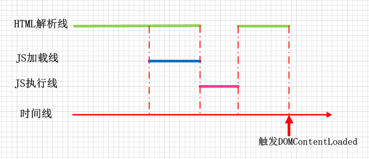
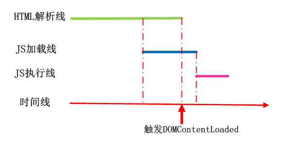

# HTML 文档解析和渲染

## DOMContentLoaded 和 load 事件

> MDN 定义  
> DOMContentLoaded
>
> - 当初始的 HTML 文档 被 完全加载 和 解析完成 之后，DOMContentLoaded 事件被触发。
> - 而无需等待 CSS、图像和子框架的完成加载
>
> load
>
> - 当所有资源加载完成之后触发
> - 包括所有相关资源: 样式表 CSS、图像 img、脚本 js

## 首次渲染和白屏

在 body 中第一个 script 资源下载完成之前，浏览器会进行**首次渲染**。

将该 script 标签前面的 DOM 树和 CSSOM 合并成一棵 Render 树，渲染到页面中。

这是页面从**白屏**到首次渲染的时间节点，即 DOMContentLoaded 触发之前经历的 HTML 文档加载和解析的时间。

## 遇到 `<script>` 标签

- 当遇到（同步）脚本（标签中不含 `async` 或 `defer`）则停止 HTML 解析，先去加载脚本，然后执行，执行结束后继续解析 HTML 文档
- 当遇到 `defer` 脚本，则在后台加载脚本。文档解析过程不中断，而等文档解析结束之后，defer 脚本执行
- 当遇到 `async` 脚本，则在后台加载脚本。文档解析过程不中断，脚本加载完成后，文档停止解析，脚本执行，执行结束后文档继续解析

## `<script>` 和 DOMContentLoaded

### 同步脚本

标签中不含 `async` 或 `defer`

```HTML
  <script src="***.js" charset="utf-8"></script>
```

- HTML 文档被解析时如果遇见（同步）脚本，则停止解析。
- 先去加载脚本，然后执行，执行结束后继续解析 HTML 文档。
- HTML 文档解析完毕后触发 DOMContentLoaded。



### `defer` 脚本

当 HTML 文档被解析时如果遇见 `defer` 脚本

- 则在后台加载脚本，文档解析过程不中断
- 等文档解析结束之后，defer 脚本执行。

```HTML
  <script src="***.js" charset="utf-8" defer></script>
```

1. HTML 还没解析完成时，defer 脚本已经加载完毕

- defer 脚本将等待 HTML 解析完成后再执行
- defer 脚本执行完毕后触发 DOMContentLoaded 事件



2. HTML 解析完成时，defer 脚本还没加载完毕

- defer 脚本继续加载，加载完成后直接执行
- defer 脚本执行完毕后触发 DOMContentLoaded 事件



### `async` 脚本

当 HTML 文档被解析时如果遇见 `async` 脚本

- 则在后台加载脚本，文档解析过程不中断。
- 脚本加载完成后，文档停止解析，脚本执行，执行结束后文档继续解析。

```HTML
  <script src="***.js" charset="utf-8" async></script>
```

1. HTML 还没有被解析完的时候，async 脚本已经加载完成

- HTML 停止解析，去执行脚本
- 脚本执行完毕后触发 DOMContentLoaded 事件



2. HTML 解析完了之后，async 脚本才加载完成

- 执行脚本
- 在 HTML 解析完毕、async 脚本还没加载完的时候就触发 DOMContentLoaded 事件

