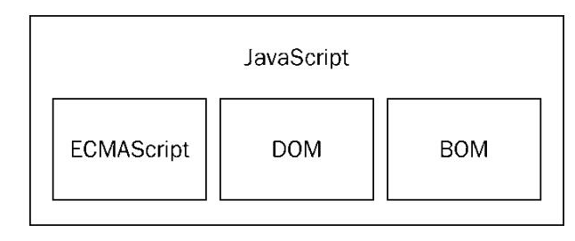

# JavaScript 简介

## 简史

> 浏览器大战

1990 年，蒂姆·伯纳斯·李开发了第一个网页浏览器 WorldWideWeb，后改名为 Nexus。蒂姆·伯纳斯－李建立的第一个网站（也是世界上第一个网站）是http://info.cern.ch/，它于1991年8月6日上网，它解释了万维网是什么，如何使用网页浏览器和如何建立一个网页服务器等等，WorldWideWeb浏
览器支持早期的HTML标记语言，功能比较简单，只能支持文本、简单的样式表、电影、声音、图片等资源的显示。

1993 年，马克·安德森领导的团开发了一个真正有影响力的浏览器 Mosaic，这就是后来世界上最流行的浏览器 Netscape Navigator。

1995 年，微软推出了闻名于世的浏览器 Internet Explorer。

1998 年，Netscape 公司开放 Netscape Navigator 源代码，成立了 Mozilla 基金会。

2001 年，最初浏览器写超过 20 行的 javascript 代码就会崩溃，直到 2001 年微软发布了 ie6，首次实现对 js 引擎的优化和分离。（瞬间 js 提升到万行以上）

2003 年，苹果公司发布了 Safari 浏览器。

2004 年，Netscape 公司发布了著名的开源浏览器 Mozilla Firefox

2005 年，苹果公司开源了浏览器中的核心代码，基于此发起了一个新的开源项目 WebKit（Safari 浏览器的内核）。

2008 年，Google 发布最新浏览器 Chrome，它是采用优化后的 javascript 引擎，引擎代码号 V8，因能把 js 代码直接转化为机械码来执行，进而以速度快而闻名。（ V8 前 javascript 运行是先翻译成 c 语言，在翻译成汇编语言，最后转化为机械码才能运行，而 V8 直接是直接把 javascript 翻译成机械码，所以 Chrome 是最快的）

Firefox4.0：V8 之后 Firefox 也推出了具备强大功能的 js 引擎，Firefox3.5 TraceMonkey（对频繁执行的代码做了路径优化）,Firefox4.0 JeagerMonkey

2009 年，ECMAScript 5 添加 "strict mode"，严格模式 添加 JSON 支持

2011 年，ECMAScript 5.1 版本变更

2015 年，ECMAScript 6

之后基本每年更新一个版本，详情查看 ECMA-262

## JavaScript 特点

- 是解释型语言
- 语法特点
  - 基本语法：借鉴 C 语言和 Java 语言
  - 数据结构：借鉴 Java 语言，包括将值分为原始值和对象两大类
  - 内存管理：借鉴 Java 语言
  - 函数用法：借鉴 Schema 语言和 AWK 语言，引入闭包
  - 原型继承模型：借鉴 Self 语言
  - 正则表达式：借鉴 Perl 语言
  - 字符串和数组处理：借鉴 Python 语言

## JavaScript 实现

> JavaScript = ECMAScript + DOM + BOM

### ECMAScript

> ECMAScript 只是定义语言基础  
> ECMAScript 语言本身没有定义输入输出  
> 由 ECMA-262 定义的 ECMAScript 与 Web 浏览器没有依赖关系

- 定义语言描述
  - 语法
  - 数据类型
  - 语句
  - 关键字
  - 保留字
  - 操作符
- 主要版本
  - ES5：ECMA-262 第 5 版，发布于 2009 年
  - ES6：ECMA-262 第 5 版，发布于 2016 年
- ECMAScript 兼容及实现
  - ECMA-262 给出的 ECMAScript 兼容的定义；想要成为 ECMAScript 的实现，必须做到
    - 支持：ECMA-262 描述的所有类型、值、对象、属性、函数及程序句法和语义
    - 支持 Unicode 字符标准
    - 支持扩展
      - ECMA-262 没有描述的所有 类型、值、对象、属性和函数
      - ECMA-262 没有定义的程序和正则表达式语法
- ECMAScript 宿主环境
  - 宿主环境要求
    - 提供基本的 ECMAScript **实现**
    - 提供该语言的扩展，以便**语言**与**环境**之间对接**交互**
  - 主要的宿主环境
    - Web 浏览器
    - Node.js
    - Adobe Flash

### DOM

> - DOM: 文档对象模型 Document Object Model
> - DOM（文档对象模型）是 HTML 和 XML 的应用程序接口（API）
> - DOM 把整个 HTML 映射为一个多层节点结构（DOM 树）

W3C 指定 DOM 标准：不同浏览器的不同实现，浏览器兼容性，Web 跨平台性

- DOM 级别
  - DOM0
    - 实际上，DOM0 级标准是不存在的
    - 只是 DOM 历史坐标中的一个参照点而已
    - 指的是 IE4 和 Navigator4 最初支持的 DHTML
  - DOM1
    - DOM Core: 如何映射基于 XML 的文档结构，以便简化对文档中任意部分的访问和操作
    - DOM HTML：在 DOM 核心基础上，加以扩展，添加了针对 HTML 的对象和方法
  - DOM2
    - 扩展
      - 鼠标、用户界面事件、范围、遍历（迭代 DOM 文档的方法）
      - 通过对象接口，增加了对 CSS 的支持，CSSOM
      - DOM 核心扩展：开始支持 XML 命名空间
    - 新模块
      - DOM 视图：跟踪不同文档视图的接口（如，应用 CSS 之前和之后的文档）
      - DOM 事件：事件和事件处理接口
      - DOM 样式：基于 CSS 为元素应用样式的接口
      - DOM 遍历和范围：遍历和操作 DOM 树的接口
  - DOM3
    - 扩展
      - 引入以统一方式加载和保存文档的方法：DOM 加载和保护模块（DOM Load and Save）
      - 验证文档的方法：DOM 验证（DOM validation）
      - DOM 核心扩展：支持 XML 1.0 规范，设计 XML Infoset、XPath、XML Base

### BOM

> - BOM: 浏览器对象模型 Browser Object Model
> - HTML5 把很多 BOM 功能写入正式规范
> - 根本上，只处理浏览器窗口和框架
> - 习惯上，把所有针对浏览器的 JavaScript 扩展，也算作 BOM 的一部分

- BOM 内容
  - navigator
  - location
  - screen
  - 浏览器窗口
  - 请求对象：XMLHTTPRequest 和 IE 的 ActiveXObject
  - cookies