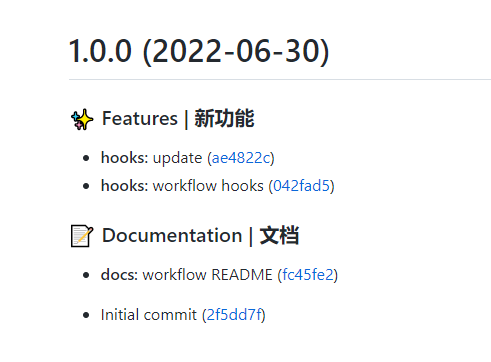

# 前端规范化工作流

主要是各个环节的规范化

代码规范校验，commit 规范校验，CHANGELOG.md 生成，版本升级等

从各个框架源码中可以看出，现在这个体系是比较成熟的

主要内容：Git + Git Hooks + lint-stage + eslint + commitizen

[Github Demo](https://github.com/wangzhije/frontend-workflow.git)

先看下大致效果图



## 代码管理 Git

配置

- 用户名 `git config --[local/global/system] user.name "wangzhijie"`
- 邮箱 `git config --[local/global/system] user.name "1662285571@qq.com"`
- 记住密码 `git config --[local/global/system] credential.helper store`

<!-- ## 分支管理 GitFlow 分支模型 -->

<!-- 具体查看 [Git Flow 分支模型]()的几种常用形式 -->

## 包管理工具

### only-allow：一句代码，统一项目包管理工具

```json
// package.json
{
  "script": {
    "preinstall": "npx only-allow yarn"
  }
}
```

问题

1. yarn 和 npm 的 preinstall hook 调用时机不同
   - `npm` 只会在 `npm install` 安装整个项目依赖时调用
   - `npm install <package>`安装单个 package 时不调用；所以不会执行，也就无法限制使用 npm 安装

### 自定义

Vue3 源码

```json
// package.json
{
  "script": {
    "preinstall": "node ./scripts/preinstall.js"
  }
}
```

```JavaScript
// preinstall.js
// 主要是根据 node env npm 环境变量判断
const isPnpm = /pnpm/.test(process.env.npm_execpath || '')
if (!isPnpm) {
  console.warn('当前包管理器不是 pnpm'); // 命令行打印信息
  process.exit(1); // 错误退出 node 命令行
}
```

## 提交规范

1. Commitizen

- `npm install commitizen --save-dev`
- `npx commitizen init <adapterName:cz-customizable> --save-dev --save-exact`
- 自定义 `npm install cz-customizable -D`
  - 配置 `.cz-config.js`

2. ChangeLog

- `npm install conventional-changelog-cli --save-dev`
- 配置 `changelog-options.js`
  - 在之前 CHANGELOG.md 基础上叠加，更新最近一个 tag 的 commit msg
    - `conventional-changelog -p angular -i CHANGELOG.md -s`
  - 更新全部 commit msg, 覆盖 CHANGELOG.md
    - `conventional-changelog -p angular -i CHANGELOG.md -s -r 0`

3. CommitLint 提交信息检查

- `npm install @commitlint/cli @commitlint/config-conventional --save-dev`
- 配置 `commitlint.config.js`
  - `echo "module.exports = {extends: ['@commitlint/config-conventional']};" > commitlint.config.js`

## Git Hooks

- husky 使用 git hooks
  - `npm install husky --save-dev`
  - `npx husky install`
  - `npx husky add .husky/pre-commit "npm run pre-commit"`
  - `npx husky add .husky/pre-commit "npm run commit-msg"`
- `prepare-commit-msg`: 启动提交信息编辑器之前
  - `"prepare-commit-msg": "exec < /dev/tty && git cz --hook || true"`
- `pre-commit`：执行 commit 前？
  - CodeLint 代码规范校验
    - eslint: 规范并校验 ECMAScript/JavaScript code 的编写
    - tslint: 规范并校验 TypeScript code 的编写
    - stylelint: 规范并校验 css/scss/less code 的编写
    - prettier 或 beautifyjs 统一代码排版格式
    - lint-staged: 只检测暂存区的文件，提升速度
    - changelog: 生成 changelog（也可以配置在 tag 或 release 时）
- `commit-msg`: 启动提交信息编辑器之前
  - CommitLint 提交规范校验
- `git push`

## 具体配置

```json
// package.json
{
  "scripts": {
    "preinstall": "npx only-allow npm",
    "commit": "cz",
    "version": "conventional-changelog -p angular -i CHANGELOG.md -s && git add CHANGELOG.md",
    "changelog": "conventional-changelog -p angular -i CHANGELOG.md -s -r 0 && git add CHANGELOG.md",
    "prepare-commit-msg": "exec < /dev/tty && git cz --hook || true",
    "config": {
      "commitizen": {
        // "path": "cz-conventional-changelog"
        "path": "./node_modules/cz-customizable"
      }
    }
  }
}
```

```javascript
// .cz-config.js
module.exports = {
  // type 类型(定义之后，可通过上下键选择)
  types: [
    { value: "feat ", name: "✨ Features | 新功能" },
    { value: "fix", name: "🐛 Bug Fixes | Bug 修复" },
    { value: "docs", name: "docs:📝 Documentation | 文档" },
    { value: "style", name: "💄 Styles | 风格" },
    { value: "refactor", name: "♻ Code Refactoring | 代码重构" },
    { value: "perf", name: "⚡ Performance Improvements | 性能优化" },
    { value: "test", name: "✅ Tests | 测试" },
    { value: "build", name: "👷‍ Build System | 构建" },
    { value: "ci", name: "🔧 Continuous Integration | CI 配置" },
    { value: "chore", name: "Chores | 其他更新(不影响源文件、测试用例等)" },
    { value: "revert", name: "⏪ Reverts | 回退" },
  ],
  // scope 类型(定义之后，可通过上下键选择)
  scopes: [
    ["components", "组件相关"],
    ["hooks", "hook 相关"],
    ["utils", "utils 相关"],
    ["element-ui", "对 element-ui 的调整"],
    ["styles", "样式相关"],
    ["deps", "项目依赖"],
    ["auth", "对 auth 修改"],
    ["other", "其他修改"],
    // 如果选择 custom，后面会让你再输入一个自定义的 scope。也可以不设置此项，把后面的 allowCustomScopes 设置为 true
    ["custom", "以上都不是？我要自定义"],
  ].map(([value, description]) => {
    return {
      value,
      name: `${value.padEnd(30)} (${description})`,
    };
  }),

  // 是否允许自定义填写 scope，在 scope 选择的时候，会有 empty 和 custom 可以选择。
  // allowCustomScopes: true,

  // allowTicketNumber: false,
  // isTicketNumberRequired: false,
  // ticketNumberPrefix: 'TICKET-',
  // ticketNumberRegExp: '\\d{1,5}',

  // 针对每一个 type 去定义对应的 scopes，例如 fix
  /*
  scopeOverrides: {
    fix: [
      { name: 'merge' },
      { name: 'style' },
      { name: 'e2eTest' },
      { name: 'unitTest' }
    ]
  },
  */

  // 交互提示信息
  messages: {
    type: "确保本次提交遵循 Angular 规范！\n选择你要提交的类型:",
    scope: "\n选择一个 scope(可选):",
    // 选择 scope: custom 时会出下面的提示
    customScope: "请输入自定义的 scope:",
    subject: "填写简短精炼的变更描述:\n",
    body: '填写更加详细的变更描述(可选)。使用 "|" 换行:\n',
    breaking: "列举非兼容性重大的变更(可选):\n",
    footer: "列举出所有变更的 ISSUES CLOSED(可选)。 例如: #31, #34:\n",
    confirmCommit: "确认提交？",
  },

  // 设置只有 type 选择了 feat 或 fix，才询问 breaking message
  allowBreakingChanges: ["feat", "fix"],

  // 跳过要询问的步骤
  skipQuestions: ["body", "footer"],

  // subject 限制长度
  subjectLimit: 100,
  breaklineChar: "|", // 支持 body 和 footer
  // footerPrefix : 'ISSUES CLOSED:'
  // askForBreakingChangeFirst : true,
};
```

```JavaScript
// commitlint.config.js
module.exports = {
  extends: ['@commitlint/config-conventional'], // 基于 @commitlint/config-conventional 扩展
  parserPreset: 'conventional-changelog-conventionalcommits', // commit 信息的格式解析器
  rules: {
    'scope-empty': [0], // scope非必填
    'subject-case': [
      2,
      'always',
      [
        'lower-case', // default
        'upper-case', // UPPERCASE
        'camel-case', // camelCase
        'kebab-case', // kebab-case
        'pascal-case', // PascalCase
        'sentence-case', // Sentence case
        'snake-case', // snake_case
        'start-case', // Start Case
      ],
    ],
    'subject-full-stop': [2, 'never', '.'],
    'type-enum': [
      2,
      'always',
      [
        'build',
        'ci',
        'chore',
        'docs',
        'feat',
        'fix',
        'perf',
        'refactor',
        'revert',
        'style',
        'test'
      ]
    ]
  }
}
```
