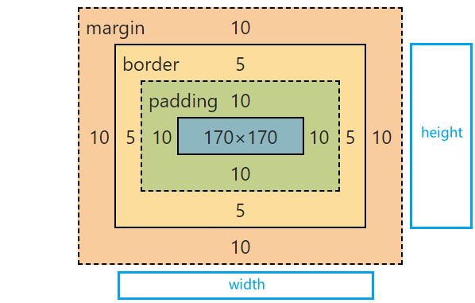

## 盒模型简述

在网页布局中，盒模型（Box Model）是一个非常基础且重要的概念。每一个 HTML 元素在页面中都会被看作一个矩形的盒子，这个盒子由内容区（Content）、 内边距（Padding）、边框（Border）和外边距（Margin）这几个部分组成

## 盒模型的组成部分

- 外边距（Margin）：元素与其他元素之间的距离，可通过 margin-top、margin-right、margin-bottom、margin-left 分别设置四个方向的外边距，也有 margin 简写属性。外边距不会影响元素自身的大小，但会影响元素在页面中的布局位置。
- 边框（Border）：围绕在内边距和内容区周围的线条，可通过 border-width、border-style 和 border-color 来定义边框的宽度、样式和颜色，同样也有简写属性 border。边框也会计入元素的整体大小。
- 内边距（Padding）：内容区与边框之间的距离，可通过 padding-top、padding-right、padding-bottom、padding-left 分别设置四个方向的内边距，也可以使用 padding 简写属性。内边距会影响元素的整体大小。
- 内容区（Content）：元素实际包含的内容，如文本、图片等，其大小由 width 和 height 属性控制（对于行内元素，宽度和高度由内容决定）。

## 盒模型的类型及区别

在 CSS 中，盒模型主要分为标准盒模型（ W3C 规定）和怪异盒模型（IE 盒模型），它们的主要区别在于元素宽度和高度的计算方式不同。

### 标准盒模型（content-box）

- 计算方式：元素的宽度（width）和高度（height）只包含内容区的宽度和高度，不包含内边距、边框和外边距。也就是说

### 怪异盒模型（border-box）

- 计算方式：元素的宽度（width）和高度（height）包含了内容区、内边距和边框的大小

