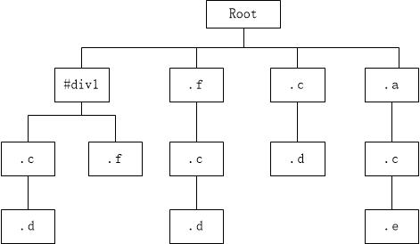
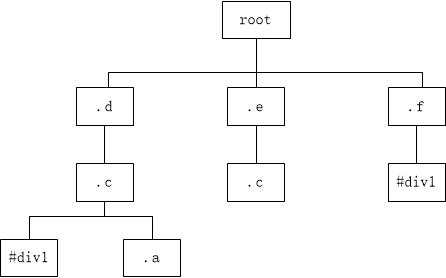

# CSS 渲染

## CSS 选择器从右往左解析

CSS 尽量减少使用层级关系的目的
  - 减少选择器匹配的次数
  - 提高 CSS 匹配效率
  - 提高 Render Tree 生成效率


### 示例

```HTML
<!-- html -->
<div id="div1">
  <div class="a">
    <div class="b">
      ...
    </div>
    <div class="c">
      <div class="d">
        ...
      </div>
      <div class="e">
        ...
      </div>
    </div>
  </div>
  <div class="f">
    <div class="c">
      <div class="d">
        ...
      </div>
  </div>
</div>
```
```CSS
/* CSS */
#div1 .c .d{}
.f .c .d{}
.a .c .e{}
#div1 .f{}
.c .d{}
```

假如 CSS 选择器从左往右解析



假如 CSS 选择器从右往左解析



结果很明显，从右往左的效率更高。